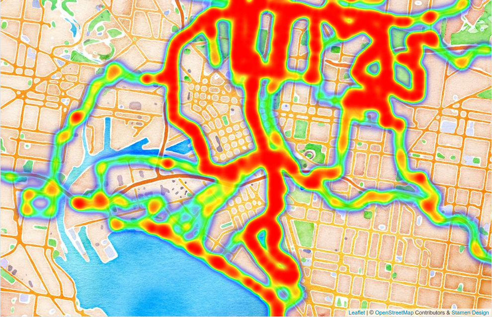

# My Strava Heatmap

Using [Leaflet](http://leafletjs.com) and
[Leaflet.heat](https://github.com/Leaflet/Leaflet.heat)
to create a heatmap of my Strava activities à la
[labs.strava.com/heatmap](https://labs.strava.com/heatmap):

